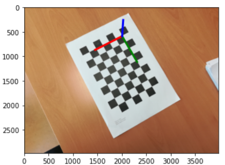
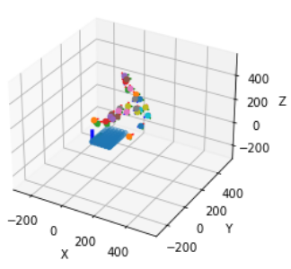

# Manual camera calibration

#### 👨‍🎓 This project was carried out during my master's degree in computer vision at URJC - Madrid

Manual calibration of the camera with a chessboard.

## Goals

- Calibrate a camera using Zhang's calibration method
- Make use of the results of the calibration to take different measurements on images
- Calibrate a camera from an image of a scene where the coordinates are unknown
- Determine the position of the camera

## Requirements

* Python 3.7+
* Jupiter notebook
* matplotlib == 3.3.4
* numpy == 1.21.3
* opencv_python == 4.5.5.*
* scipy == 1.7.1

How to install all the requirements :
```bash
$ pip install -r requirements.txt
```

## Usage

```bash
$ jupyter notebook Manual_camera_calibration.ipynb
```

or

Open ```Manual_camera_calibration.pdf```

## Results

<p align="center">
  
</p>
<p align="center">
  <i>Result of the detection of the chessboard (calibration)</i>
</p>

<p align="center">
  
</p>
<p align="center">
  <i>Camera positions after the calibration</i>
</p>

## Structure

    .
    ├── images
    │    └── *.png
    ├── Manual_camera_calibration.html
    ├── Manual_camera_calibration.ipynb
    ├── Manual_camera_calibration.pdf
    ├── README.md
    ├── requirements.txt
    └── template4
        └── *.jpg

## Authors

* **Luis Rosario** - *Initial work* - [Luisrosario2604](https://github.com/Luisrosario2604)
