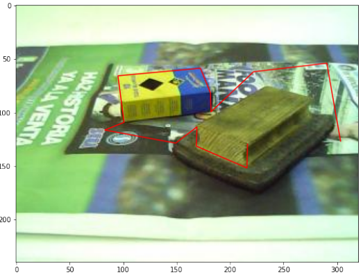
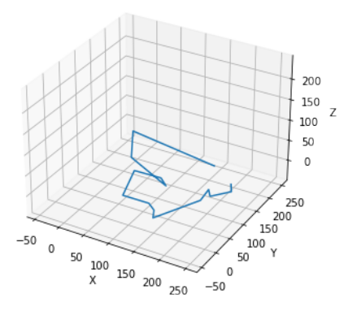

# Manual camera calibration

#### 👨‍🎓 This project was carried out during my master's degree in computer vision at URJC - Madrid

Stereo vision reconstruction, epipolar geometry ...

## Goals

- Reconstructing points in a scene from a series of manual correspondences between two calibrated images
- Determine the epipolar geometry of a scene from a series of manual correspondences
- Determine the epipolar geometry of a pair of cameras from their projection matrices
- Make a dense reconstruction of the scene

## Requirements

* Python 3.7+
* Jupiter notebook
* matplotlib == 3.3.4
* misc == 0.0.0
* numpy == 1.21.*
* opencv_python == 4.5.5.*

How to install all the requirements :
```bash
$ pip install -r requirements.txt
```

## Usage

```bash
$ jupiter notebook Stereo_vision_reconstruction.ipynb
```

or

Open ```Stereo_vision_reconstruction.pdf```

## Results

<p align="center">
  
</p>
<p align="center">
  <i>line to be determined in a 3D space (left image)</i>
</p>

<p align="center">
  
</p>
<p align="center">
  <i>Result of the line in a 3D space</i>
</p>

## Structure

    .
    ├── 9.6.png
    ├── building
    │    └── build_*.jpg
    ├── cameras.npz
    ├── Imagenes_tk
    │    └── *.png
    ├── images
    │    └── *.png
    ├── pt1_building.pkl
    ├── pt1.pkl
    ├── pt2_building.pkl
    ├── pt2.pkl
    ├── README.md
    ├── Stereo_vision_reconstruction.ipynb
    └── Stereo_vision_reconstruction.pdf

## Authors

* **Luis Rosario** - *Initial work* - [Luisrosario2604](https://github.com/Luisrosario2604)
